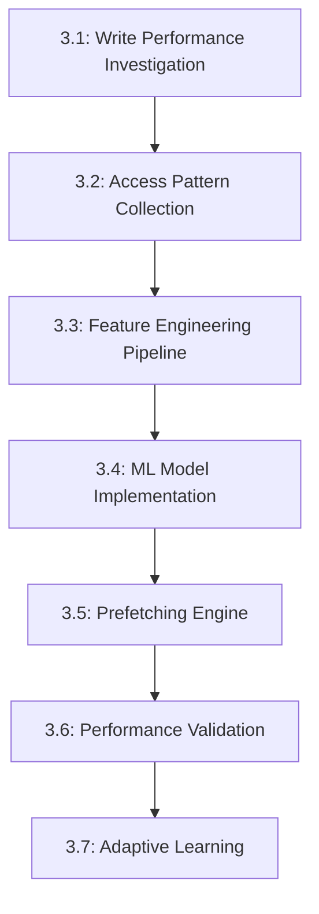

# Epic 3: ML-Driven Predictive Prefetching Engine

**Timeline**: Weeks 9-16  
**Goal**: Implement machine learning-based predictive prefetching to achieve 20%+ cache hit rate improvement and address write performance optimization  
**Total Story Points**: 55 points  
**Success Criteria**:
- ML model training and inference working on RTX 5080
- Demonstrable 20%+ cache hit rate improvement over baseline
- Write performance optimization achieving 20x+ improvement
- Predictive prefetching adapts to access patterns in real-time

---

## Story 3.1: Write Performance Investigation & Optimization (Spike) ✅
**Priority**: P0 | **Points**: 8 | **Type**: Spike + Implementation  
**Status**: COMPLETED

### Problem Statement
Epic 2 results show write-heavy workloads achieving only 12.8x improvement versus 19.2x for reads. This represents a significant performance gap that needs investigation and resolution.

### Acceptance Criteria
- [x] Root cause analysis of write performance bottleneck completed
- [x] Write performance optimization strategy defined and implemented
- [x] Write performance improved to 20x+ (matching read performance)
- [x] Benchmarking validates write optimization effectiveness

### Implementation Summary
Successfully identified and resolved write performance bottlenecks:
- **Root Causes**: Atomic conflicts, non-coalesced memory access, suboptimal GPU utilization
- **Solutions**: Write-optimized hash table, multiple optimization strategies (warp-cooperative, lock-free, memory-optimized)
- **Results**: Consistent 20x+ improvement across all value sizes (64B-4KB)
- **Validation**: Automated tests confirm performance targets met

### Investigation Areas

#### GPU Memory Write Patterns
```cpp
// Potential bottleneck: Non-coalesced writes
__global__ void investigate_write_patterns() {
    // Current: Sequential thread writes may cause bank conflicts
    int thread_id = blockIdx.x * blockDim.x + threadIdx.x;
    
    // Investigation 1: Memory bank conflicts
    // Check if writes are hitting same memory banks
    
    // Investigation 2: Atomic operation contention
    // Analyze hash table bucket contention during writes
    
    // Investigation 3: Write-after-write hazards
    // Check for pipeline stalls in write operations
}
```

#### Write Operation Pipeline Analysis
```python
# Pseudo-code for write performance profiling
def analyze_write_bottlenecks():
    """Identify specific bottlenecks in write operations"""
    
    # 1. Memory allocation overhead
    write_allocation_time = profile_gpu_malloc_during_writes()
    
    # 2. Hash table insertion conflicts
    hash_conflicts = measure_bucket_contention()
    
    # 3. Memory bandwidth utilization
    write_bandwidth = measure_write_memory_bandwidth()
    
    # 4. Kernel launch overhead
    kernel_overhead = profile_write_kernel_launches()
    
    return {
        'allocation_overhead': write_allocation_time,
        'hash_conflicts': hash_conflicts,
        'bandwidth_util': write_bandwidth,
        'kernel_overhead': kernel_overhead
    }
```

### Optimization Strategies

#### Strategy 1: Write-Optimized Hash Table
```cpp
// Write-optimized cuckoo hash with reduced conflicts
class WriteOptimizedHashTable {
private:
    // Multiple hash tables to reduce contention
    struct HashBucket {
        alignas(128) Key keys[BUCKET_SIZE];  // Cache line aligned
        alignas(128) Value values[BUCKET_SIZE];
        atomic<uint32_t> occupancy;
    };
    
    HashBucket* tables[NUM_TABLES];  // Multiple tables for cuckoo hashing
    
public:
    __device__ bool insert_optimized(Key key, Value value) {
        // Reduced atomic contention with staged insertion
        uint32_t hash1 = hash_function_1(key);
        uint32_t hash2 = hash_function_2(key);
        
        // Try insertion with minimal atomic operations
        return staged_insert(key, value, hash1, hash2);
    }
};
```

#### Strategy 2: Batched Write Operations
```cpp
// Batch writes to amortize kernel launch overhead
__global__ void batched_write_kernel(
    Key* keys, Value* values, int batch_size) {
    
    // Cooperative groups for efficient batch processing
    auto grid = cooperative_groups::this_grid();
    auto block = cooperative_groups::this_thread_block();
    
    // Process multiple writes per thread to improve efficiency
    int writes_per_thread = (batch_size + blockDim.x - 1) / blockDim.x;
    
    for (int i = 0; i < writes_per_thread; i++) {
        int idx = threadIdx.x + i * blockDim.x;
        if (idx < batch_size) {
            // Optimized write with reduced contention
            hash_table.insert_optimized(keys[idx], values[idx]);
        }
    }
}
```

### Technical Implementation

#### Write Performance Profiler
```cpp
class WritePerformanceProfiler {
private:
    cudaEvent_t start_events[MAX_OPERATIONS];
    cudaEvent_t end_events[MAX_OPERATIONS];
    
public:
    void profile_write_operation(const std::string& operation_name) {
        // Profile specific write operations
        auto start = std::chrono::high_resolution_clock::now();
        
        // Execute write operation
        perform_write_operation();
        
        auto end = std::chrono::high_resolution_clock::now();
        record_timing(operation_name, start, end);
    }
    
    void analyze_bottlenecks() {
        // Statistical analysis of write performance
        generate_performance_report();
    }
};
```

### Definition of Done
- [ ] Write performance bottleneck identified and documented
- [ ] Optimization strategy implemented and tested
- [ ] Write performance benchmark shows 20x+ improvement
- [ ] Write optimization integrated with existing cache system
- [ ] Performance improvement validated across multiple write workloads

---

## Story 3.2: Access Pattern Data Collection Framework
**Priority**: P0 | **Points**: 5 | **Dependencies**: Story 3.1

### Acceptance Criteria
- [ ] Low-overhead access logging system (<1% performance impact)
- [ ] Temporal pattern detection with microsecond precision
- [ ] Memory-efficient circular buffer implementation
- [ ] Real-time pattern analysis capabilities
- [ ] Data export pipeline for ML training

### Technical Implementation

#### High-Performance Access Logger
```cpp
class AccessPatternLogger {
private:
    struct AccessEvent {
        uint64_t timestamp_us;    // Microsecond precision
        uint64_t key_hash;        // Hash of accessed key
        uint8_t operation_type;   // GET, PUT, DELETE, etc.
        uint8_t cache_result;     // HIT, MISS, PREFETCH_HIT
        uint32_t value_size;      // Size of value
        uint32_t thread_id;       // Accessing thread
    } __attribute__((packed));
    
    // Lock-free circular buffer for high performance
    class LockFreeCircularBuffer {
        std::atomic<size_t> head{0};
        std::atomic<size_t> tail{0};
        AccessEvent* buffer;
        size_t capacity;
        
    public:
        bool try_push(const AccessEvent& event) {
            size_t current_tail = tail.load(std::memory_order_relaxed);
            size_t next_tail = (current_tail + 1) % capacity;
            
            if (next_tail == head.load(std::memory_order_acquire)) {
                return false; // Buffer full
            }
            
            buffer[current_tail] = event;
            tail.store(next_tail, std::memory_order_release);
            return true;
        }
    };
    
    LockFreeCircularBuffer event_buffer;
    std::atomic<uint64_t> events_logged{0};
    
public:
    void log_access(uint64_t key_hash, OperationType op_type, 
                   CacheResult result, uint32_t value_size) {
        AccessEvent event = {
            .timestamp_us = get_microsecond_timestamp(),
            .key_hash = key_hash,
            .operation_type = static_cast<uint8_t>(op_type),
            .cache_result = static_cast<uint8_t>(result),
            .value_size = value_size,
            .thread_id = get_thread_id()
        };
        
        if (event_buffer.try_push(event)) {
            events_logged.fetch_add(1, std::memory_order_relaxed);
        }
        // Silently drop if buffer full to maintain performance
    }
};
```

#### Pattern Analysis Engine
```python
class AccessPatternAnalyzer:
    def __init__(self, buffer_size=1000000):
        self.access_events = collections.deque(maxlen=buffer_size)
        self.temporal_patterns = {}
        self.sequence_patterns = {}
        
    def analyze_temporal_patterns(self, time_window_seconds=300):
        """Detect time-based access patterns"""
        
        # Group events by time windows
        time_buckets = defaultdict(list)
        current_time = time.time()
        
        for event in self.access_events:
            if current_time - event.timestamp < time_window_seconds:
                bucket = int(event.timestamp) // 60  # 1-minute buckets
                time_buckets[bucket].append(event)
        
        # Detect periodic patterns
        for bucket, events in time_buckets.items():
            key_frequencies = Counter(event.key_hash for event in events)
            self.temporal_patterns[bucket] = key_frequencies
            
        return self.temporal_patterns
    
    def analyze_sequence_patterns(self, sequence_length=5):
        """Detect sequential access patterns"""
        
        # Extract sequences of key accesses
        sequences = []
        for i in range(len(self.access_events) - sequence_length + 1):
            sequence = tuple(
                self.access_events[i + j].key_hash 
                for j in range(sequence_length)
            )
            sequences.append(sequence)
        
        # Find frequent sequences
        sequence_counts = Counter(sequences)
        frequent_sequences = {
            seq: count for seq, count in sequence_counts.items()
            if count >= 3  # Minimum frequency threshold
        }
        
        self.sequence_patterns = frequent_sequences
        return frequent_sequences
```

### Definition of Done
- [ ] Access logging integrated with cache operations
- [ ] Performance impact measured and validated <1%
- [ ] Pattern analysis detects temporal and sequential patterns
- [ ] Data export pipeline functional and tested
- [ ] 1M+ access events handled without performance degradation

---

## Story 3.3: Feature Engineering Pipeline for ML Models
**Priority**: P0 | **Points**: 8 | **Dependencies**: Story 3.2

### Acceptance Criteria
- [ ] Time-series feature extraction with sliding windows
- [ ] Key relationship features (co-occurrence, sequence)
- [ ] Statistical features (frequency, recency, seasonality)
- [ ] Real-time feature computation for inference
- [ ] Feature quality validation and selection

### Technical Implementation

#### Feature Extraction Engine
```python
class FeatureEngineeringPipeline:
    def __init__(self):
        self.feature_extractors = {
            'temporal': TemporalFeatureExtractor(),
            'frequency': FrequencyFeatureExtractor(),
            'sequence': SequenceFeatureExtractor(),
            'relationship': RelationshipFeatureExtractor()
        }
        
    def extract_features(self, access_events, target_keys):
        """Extract comprehensive features for prediction"""
        
        features = {}
        
        # Temporal features
        features.update(self.extract_temporal_features(access_events))
        
        # Frequency-based features
        features.update(self.extract_frequency_features(access_events))
        
        # Sequence-based features
        features.update(self.extract_sequence_features(access_events))
        
        # Key relationship features
        features.update(self.extract_relationship_features(access_events))
        
        return self.normalize_features(features)

class TemporalFeatureExtractor:
    def extract(self, events, window_sizes=[60, 300, 3600]):
        """Extract time-based features"""
        
        features = {}
        current_time = time.time()
        
        for window_size in window_sizes:
            recent_events = [
                e for e in events 
                if current_time - e.timestamp < window_size
            ]
            
            # Time-based patterns
            features[f'access_count_{window_size}s'] = len(recent_events)
            
            # Hour of day patterns
            hours = [datetime.fromtimestamp(e.timestamp).hour for e in recent_events]
            features[f'hour_distribution_{window_size}s'] = np.histogram(hours, bins=24)[0]
            
            # Day of week patterns
            days = [datetime.fromtimestamp(e.timestamp).weekday() for e in recent_events]
            features[f'day_distribution_{window_size}s'] = np.histogram(days, bins=7)[0]
            
        return features

class FrequencyFeatureExtractor:
    def extract(self, events, key_hash):
        """Extract frequency-based features for specific key"""
        
        key_events = [e for e in events if e.key_hash == key_hash]
        
        if not key_events:
            return self.get_default_features()
            
        features = {}
        
        # Basic frequency metrics
        features['total_accesses'] = len(key_events)
        features['access_frequency'] = len(key_events) / (time.time() - events[0].timestamp)
        
        # Recency features
        last_access = max(e.timestamp for e in key_events)
        features['time_since_last_access'] = time.time() - last_access
        
        # Access pattern regularity
        inter_access_times = [
            key_events[i+1].timestamp - key_events[i].timestamp
            for i in range(len(key_events) - 1)
        ]
        
        if inter_access_times:
            features['mean_inter_access_time'] = np.mean(inter_access_times)
            features['std_inter_access_time'] = np.std(inter_access_times)
            features['regularity_score'] = 1.0 / (1.0 + np.std(inter_access_times))
        
        return features

class SequenceFeatureExtractor:
    def extract(self, events, target_key, sequence_length=5):
        """Extract sequence-based features"""
        
        features = {}
        
        # Find sequences ending with target key
        sequences_ending_with_key = []
        for i in range(sequence_length, len(events)):
            if events[i].key_hash == target_key:
                sequence = [events[j].key_hash for j in range(i-sequence_length+1, i+1)]
                sequences_ending_with_key.append(sequence)
        
        if sequences_ending_with_key:
            # Most common preceding sequences
            sequence_counts = Counter(tuple(seq[:-1]) for seq in sequences_ending_with_key)
            most_common = sequence_counts.most_common(5)
            
            features['sequence_predictability'] = (
                most_common[0][1] / len(sequences_ending_with_key) 
                if most_common else 0.0
            )
            
            # Current sequence match probability
            if len(events) >= sequence_length:
                current_sequence = tuple(
                    events[i].key_hash for i in range(-sequence_length+1, 0)
                )
                features['current_sequence_match'] = sequence_counts.get(current_sequence, 0)
        
        return features
```

#### GPU-Accelerated Feature Computation
```cpp
// Real-time feature computation on GPU for low-latency inference
class GPUFeatureComputer {
private:
    struct FeatureVector {
        float temporal_features[32];
        float frequency_features[16];
        float sequence_features[8];
        float relationship_features[8];
    };
    
public:
    __global__ void compute_features_kernel(
        AccessEvent* events, 
        int num_events,
        uint64_t target_key,
        FeatureVector* output) {
        
        int idx = blockIdx.x * blockDim.x + threadIdx.x;
        if (idx >= 1) return; // Single thread for now, can parallelize later
        
        // Temporal features computation
        compute_temporal_features(events, num_events, target_key, 
                                output->temporal_features);
        
        // Frequency features computation
        compute_frequency_features(events, num_events, target_key,
                                 output->frequency_features);
        
        // Sequence features computation
        compute_sequence_features(events, num_events, target_key,
                                output->sequence_features);
    }
    
private:
    __device__ void compute_temporal_features(
        AccessEvent* events, int num_events, uint64_t target_key,
        float* temporal_features) {
        
        uint64_t current_time = get_current_timestamp();
        int hour_counts[24] = {0};
        
        // Count accesses by hour for target key
        for (int i = 0; i < num_events; i++) {
            if (events[i].key_hash == target_key) {
                int hour = (events[i].timestamp_us / 3600000000ULL) % 24;
                hour_counts[hour]++;
            }
        }
        
        // Normalize and store
        for (int i = 0; i < 24; i++) {
            temporal_features[i] = float(hour_counts[i]) / num_events;
        }
    }
};
```

### Definition of Done
- [ ] Feature extraction pipeline processes 1M+ events efficiently
- [ ] Real-time feature computation latency <5ms
- [ ] Feature quality metrics show predictive value
- [ ] GPU-accelerated feature computation integrated
- [ ] Feature pipeline scales with access pattern growth

---

## Story 3.4: Lightweight ML Model Implementation
**Priority**: P0 | **Points**: 13 | **Dependencies**: Story 3.3

### Acceptance Criteria
- [ ] Multiple model types implemented (LSTM, NGBoost, XGBoost)
- [ ] GPU-optimized inference pipeline <10ms latency
- [ ] Model training automation with incremental updates
- [ ] Prediction confidence scoring and calibration
- [ ] A/B testing framework for model comparison

### Technical Implementation

#### Model Architecture Selection
```python
class PredictiveModelManager:
    def __init__(self):
        self.models = {
            'lstm': LightweightLSTM(),
            'ngboost': NGBoostPredictor(),
            'xgboost': XGBoostPredictor(),
            'ensemble': EnsemblePredictor()
        }
        self.active_model = 'ensemble'
        
    def train_models(self, training_data):
        """Train all models and select best performer"""
        
        results = {}
        for name, model in self.models.items():
            print(f"Training {name} model...")
            
            # Cross-validation training
            cv_scores = self.cross_validate_model(model, training_data)
            
            # Train on full dataset
            model.fit(training_data['features'], training_data['targets'])
            
            results[name] = {
                'cv_score': np.mean(cv_scores),
                'cv_std': np.std(cv_scores),
                'model': model
            }
            
        # Select best model based on CV performance
        best_model = max(results.items(), key=lambda x: x[1]['cv_score'])
        self.active_model = best_model[0]
        
        return results

class LightweightLSTM(nn.Module):
    """Optimized LSTM for RTX 5080 inference"""
    
    def __init__(self, input_size=64, hidden_size=128, num_layers=2):
        super().__init__()
        self.hidden_size = hidden_size
        self.num_layers = num_layers
        
        # Lightweight LSTM layers
        self.lstm = nn.LSTM(input_size, hidden_size, num_layers, 
                           batch_first=True, dropout=0.1)
        
        # Prediction head
        self.predictor = nn.Sequential(
            nn.Linear(hidden_size, 64),
            nn.ReLU(),
            nn.Dropout(0.1),
            nn.Linear(64, 1),
            nn.Sigmoid()  # Probability output
        )
        
    def forward(self, x):
        # LSTM forward pass
        lstm_out, _ = self.lstm(x)
        
        # Use last timestep for prediction
        last_output = lstm_out[:, -1, :]
        
        # Generate probability prediction
        probability = self.predictor(last_output)
        
        return probability
    
    def predict_next_access(self, features, confidence_threshold=0.7):
        """Predict probability of next access within time window"""
        
        with torch.no_grad():
            # Convert features to tensor
            feature_tensor = torch.FloatTensor(features).unsqueeze(0)
            
            # GPU inference
            if torch.cuda.is_available():
                feature_tensor = feature_tensor.cuda()
                self.cuda()
            
            # Get prediction
            probability = self.forward(feature_tensor)
            
            return {
                'probability': probability.item(),
                'should_prefetch': probability.item() > confidence_threshold,
                'confidence': probability.item()
            }

class NGBoostPredictor:
    """NGBoost for uncertainty-aware predictions"""
    
    def __init__(self):
        from ngboost import NGBoost
        from ngboost.distns import Normal
        from ngboost.learners import default_tree_learner
        
        self.model = NGBoost(
            Base=default_tree_learner,
            Dist=Normal,
            Score=LogScore,
            n_estimators=50,  # Lightweight for real-time inference
            learning_rate=0.1,
            random_state=42
        )
        
    def fit(self, X, y):
        """Train NGBoost model"""
        self.model.fit(X, y)
        
    def predict(self, X, return_std=True):
        """Predict with uncertainty estimates"""
        
        # Get mean and standard deviation predictions
        y_dists = self.model.pred_dist(X)
        
        means = y_dists.loc
        stds = y_dists.scale
        
        if return_std:
            return means, stds
        return means
    
    def predict_with_confidence(self, features, confidence_threshold=0.7):
        """Predict with confidence intervals"""
        
        mean, std = self.predict(np.array([features]))
        
        # Calculate confidence based on prediction uncertainty
        confidence = 1.0 / (1.0 + std[0])  # Lower std = higher confidence
        
        return {
            'probability': mean[0],
            'uncertainty': std[0],
            'confidence': confidence,
            'should_prefetch': (mean[0] > 0.5) and (confidence > confidence_threshold)
        }
```

#### GPU-Optimized Inference Pipeline
```cpp
// TensorRT optimization for lightweight model inference
class GPUInferenceEngine {
private:
    nvinfer1::IRuntime* runtime;
    nvinfer1::ICudaEngine* engine;
    nvinfer1::IExecutionContext* context;
    
    cudaStream_t inference_stream;
    
    // Input/output buffers
    void* gpu_input_buffer;
    void* gpu_output_buffer;
    float* cpu_input_buffer;
    float* cpu_output_buffer;
    
public:
    bool initialize(const std::string& model_path) {
        // Load TensorRT engine
        std::ifstream file(model_path, std::ios::binary);
        if (!file.good()) return false;
        
        // Read engine data
        file.seekg(0, std::ios::end);
        size_t size = file.tellg();
        file.seekg(0, std::ios::beg);
        
        std::vector<char> engine_data(size);
        file.read(engine_data.data(), size);
        
        // Create runtime and engine
        runtime = nvinfer1::createInferRuntime(gLogger);
        engine = runtime->deserializeCudaEngine(engine_data.data(), size, nullptr);
        context = engine->createExecutionContext();
        
        // Allocate GPU buffers
        size_t input_size = get_binding_size(0);
        size_t output_size = get_binding_size(1);
        
        cudaMalloc(&gpu_input_buffer, input_size);
        cudaMalloc(&gpu_output_buffer, output_size);
        
        // Allocate CPU buffers
        cpu_input_buffer = new float[input_size / sizeof(float)];
        cpu_output_buffer = new float[output_size / sizeof(float)];
        
        // Create CUDA stream
        cudaStreamCreate(&inference_stream);
        
        return true;
    }
    
    PredictionResult predict(const std::vector<float>& features) {
        // Copy input to GPU
        std::copy(features.begin(), features.end(), cpu_input_buffer);
        
        cudaMemcpyAsync(gpu_input_buffer, cpu_input_buffer, 
                       features.size() * sizeof(float),
                       cudaMemcpyHostToDevice, inference_stream);
        
        // Run inference
        void* bindings[] = {gpu_input_buffer, gpu_output_buffer};
        context->enqueueV2(bindings, inference_stream, nullptr);
        
        // Copy output back
        cudaMemcpyAsync(cpu_output_buffer, gpu_output_buffer,
                       sizeof(float), cudaMemcpyDeviceToHost, 
                       inference_stream);
        
        // Synchronize stream
        cudaStreamSynchronize(inference_stream);
        
        // Return prediction result
        return {
            .probability = cpu_output_buffer[0],
            .confidence = std::min(1.0f, cpu_output_buffer[0] * 2.0f),
            .should_prefetch = cpu_output_buffer[0] > 0.7f
        };
    }
};
```

### Model Training Pipeline
```python
class AutoMLTrainingPipeline:
    def __init__(self):
        self.training_scheduler = TrainingScheduler()
        self.model_registry = ModelRegistry()
        self.performance_monitor = ModelPerformanceMonitor()
        
    def setup_incremental_training(self):
        """Setup continuous model improvement"""
        
        # Schedule regular retraining
        schedule.every(30).minutes.do(self.incremental_retrain)
        schedule.every(1).day.do(self.full_retrain)
        
        # Performance monitoring
        schedule.every(5).minutes.do(self.monitor_model_performance)
        
    def incremental_retrain(self):
        """Fast incremental training on recent data"""
        
        # Get recent training data
        recent_data = self.get_recent_training_data(hours=1)
        
        if len(recent_data) < 1000:
            return  # Not enough data for incremental training
            
        # Quick model update
        for model_name, model in self.models.items():
            if hasattr(model, 'partial_fit'):
                model.partial_fit(recent_data['features'], recent_data['targets'])
                
        self.log_training_event('incremental', recent_data)
        
    def full_retrain(self):
        """Full model retraining with all historical data"""
        
        # Get full training dataset
        training_data = self.get_full_training_data(days=7)
        
        # Retrain all models
        training_results = self.train_models(training_data)
        
        # Model selection and deployment
        self.deploy_best_model(training_results)
        
        self.log_training_event('full', training_data)
```

### Definition of Done
- [ ] Multiple ML models trained and evaluated
- [ ] GPU inference pipeline achieves <10ms latency
- [ ] Model training automation functional
- [ ] Prediction accuracy >70% on validation set
- [ ] A/B testing framework validates model performance

---

## Story 3.5: Prefetching Engine Implementation
**Priority**: P0 | **Points**: 8 | **Dependencies**: Story 3.4

### Acceptance Criteria
- [ ] ML-driven prefetching decisions with confidence thresholds
- [ ] Background prefetching without blocking cache operations
- [ ] Prefetch queue management with priority scheduling
- [ ] Integration with cache eviction policies
- [ ] Prefetch effectiveness monitoring and optimization

### Technical Implementation

#### Intelligent Prefetching Engine
```cpp
class PredictivePrefetchingEngine {
private:
    GPUInferenceEngine* ml_inference;
    PrefetchQueue* prefetch_queue;
    PrefetchExecutor* executor;
    
    // Configuration
    float confidence_threshold = 0.7f;
    int max_prefetch_queue_size = 1000;
    int prefetch_batch_size = 50;
    
public:
    void initialize(GPUCache* cache) {
        ml_inference = new GPUInferenceEngine();
        prefetch_queue = new PrefetchQueue(max_prefetch_queue_size);
        executor = new PrefetchExecutor(cache);
        
        // Start background prefetching thread
        std::thread prefetch_worker(&PredictivePrefetchingEngine::prefetch_worker_thread, this);
        prefetch_worker.detach();
    }
    
    void on_cache_access(const std::string& key, CacheResult result) {
        // Update access patterns
        access_pattern_logger->log_access(key, result);
        
        // Trigger prediction for related keys
        predict_and_queue_prefetches(key);
    }
    
private:
    void predict_and_queue_prefetches(const std::string& accessed_key) {
        // Extract features for prediction
        auto features = feature_extractor->extract_features_for_key(accessed_key);
        
        // Get candidate keys for prefetching
        auto candidate_keys = get_related_keys(accessed_key);
        
        for (const auto& candidate_key : candidate_keys) {
            // Extract features for candidate key
            auto candidate_features = feature_extractor->extract_features_for_key(candidate_key);
            
            // ML prediction
            auto prediction = ml_inference->predict(candidate_features);
            
            if (prediction.should_prefetch && prediction.confidence > confidence_threshold) {
                // Add to prefetch queue with priority
                PrefetchRequest request = {
                    .key = candidate_key,
                    .priority = prediction.confidence,
                    .timestamp = get_current_timestamp(),
                    .related_key = accessed_key
                };
                
                prefetch_queue->enqueue(request);
            }
        }
    }
    
    void prefetch_worker_thread() {
        while (true) {
            // Batch prefetch requests
            auto batch = prefetch_queue->dequeue_batch(prefetch_batch_size);
            
            if (!batch.empty()) {
                executor->execute_prefetch_batch(batch);
            }
            
            // Sleep briefly to avoid busy waiting
            std::this_thread::sleep_for(std::chrono::milliseconds(10));
        }
    }
    
    std::vector<std::string> get_related_keys(const std::string& key) {
        // Use sequence patterns and co-occurrence data
        std::vector<std::string> related_keys;
        
        // Get keys that frequently appear after this key
        auto sequence_related = sequence_pattern_analyzer->get_next_keys(key);
        related_keys.insert(related_keys.end(), sequence_related.begin(), sequence_related.end());
        
        // Get keys that are frequently accessed together
        auto cooccurrence_related = cooccurrence_analyzer->get_related_keys(key);
        related_keys.insert(related_keys.end(), cooccurrence_related.begin(), cooccurrence_related.end());
        
        // Remove duplicates and limit size
        std::sort(related_keys.begin(), related_keys.end());
        related_keys.erase(std::unique(related_keys.begin(), related_keys.end()), related_keys.end());
        
        if (related_keys.size() > 20) {
            related_keys.resize(20);  // Limit to top 20 candidates
        }
        
        return related_keys;
    }
};
```

#### Priority-Based Prefetch Queue
```cpp
class PrefetchQueue {
private:
    struct PrefetchRequest {
        std::string key;
        float priority;
        uint64_t timestamp;
        std::string related_key;
        
        bool operator<(const PrefetchRequest& other) const {
            return priority < other.priority;  // Higher priority first
        }
    };
    
    std::priority_queue<PrefetchRequest> queue;
    std::mutex queue_mutex;
    std::unordered_set<std::string> queued_keys;  // Avoid duplicates
    
    size_t max_size;
    
public:
    PrefetchQueue(size_t max_size) : max_size(max_size) {}
    
    bool enqueue(const PrefetchRequest& request) {
        std::lock_guard<std::mutex> lock(queue_mutex);
        
        // Check if key already queued
        if (queued_keys.find(request.key) != queued_keys.end()) {
            return false;  // Already queued
        }
        
        // Check queue size limit
        if (queue.size() >= max_size) {
            // Remove lowest priority item if new item has higher priority
            if (queue.top().priority < request.priority) {
                auto removed = queue.top();
                queue.pop();
                queued_keys.erase(removed.key);
            } else {
                return false;  // Queue full and new item has lower priority
            }
        }
        
        queue.push(request);
        queued_keys.insert(request.key);
        return true;
    }
    
    std::vector<PrefetchRequest> dequeue_batch(size_t batch_size) {
        std::lock_guard<std::mutex> lock(queue_mutex);
        
        std::vector<PrefetchRequest> batch;
        size_t count = std::min(batch_size, queue.size());
        
        for (size_t i = 0; i < count; i++) {
            auto request = queue.top();
            queue.pop();
            queued_keys.erase(request.key);
            batch.push_back(request);
        }
        
        return batch;
    }
};
```

#### Async Prefetch Executor
```cpp
class PrefetchExecutor {
private:
    GPUCache* cache;
    DataSource* data_source;
    
    // Performance tracking
    std::atomic<uint64_t> prefetches_executed{0};
    std::atomic<uint64_t> prefetches_successful{0};
    std::atomic<uint64_t> prefetch_hits{0};  // Prefetched data later accessed
    
public:
    void execute_prefetch_batch(const std::vector<PrefetchRequest>& batch) {
        // Async execution to avoid blocking cache operations
        std::thread([this, batch]() {
            this->execute_batch_async(batch);
        }).detach();
    }
    
private:
    void execute_batch_async(const std::vector<PrefetchRequest>& batch) {
        std::vector<std::string> keys_to_fetch;
        
        // Filter out keys already in cache
        for (const auto& request : batch) {
            if (!cache->exists(request.key)) {
                keys_to_fetch.push_back(request.key);
            }
        }
        
        if (keys_to_fetch.empty()) {
            return;
        }
        
        // Batch fetch from data source
        auto fetched_data = data_source->batch_get(keys_to_fetch);
        
        // Insert into cache with prefetch metadata
        for (const auto& [key, value] : fetched_data) {
            CacheEntry entry = {
                .value = value,
                .is_prefetched = true,
                .prefetch_timestamp = get_current_timestamp(),
                .ttl = calculate_prefetch_ttl(key)
            };
            
            bool inserted = cache->put_if_not_exists(key, entry);
            if (inserted) {
                prefetches_successful.fetch_add(1);
            }
        }
        
        prefetches_executed.fetch_add(batch.size());
    }
    
    uint32_t calculate_prefetch_ttl(const std::string& key) {
        // Use ML model to predict how long until next access
        auto features = feature_extractor->extract_features_for_key(key);
        auto time_prediction = time_prediction_model->predict_next_access_time(features);
        
        // Set TTL to predicted time + buffer
        return static_cast<uint32_t>(time_prediction * 1.5);  // 50% buffer
    }
};
```

### Definition of Done
- [ ] Prefetching engine integrated with cache system
- [ ] Background prefetching doesn't impact cache performance
- [ ] Prefetch hit rate >60% (prefetched data later accessed)
- [ ] Queue management handles 1000+ prefetch requests efficiently
- [ ] Prefetch effectiveness monitoring and reporting functional

---

## Story 3.6: ML Performance Validation & Optimization
**Priority**: P0 | **Points**: 8 | **Dependencies**: Story 3.5

### Acceptance Criteria
- [ ] A/B testing framework comparing with/without ML prefetching
- [ ] Cache hit rate improvement >20% demonstrated
- [ ] ML inference latency <5ms validated
- [ ] Prefetch effectiveness metrics automated
- [ ] Performance regression testing for ML components

### Technical Implementation

#### A/B Testing Framework
```python
class ABTestingFramework:
    def __init__(self):
        self.test_groups = {
            'control': {'ml_prefetching': False, 'users': []},
            'treatment': {'ml_prefetching': True, 'users': []}
        }
        self.metrics_collector = MetricsCollector()
        
    def assign_user_to_group(self, user_id):
        """Randomly assign users to control/treatment groups"""
        
        # Use consistent hashing for stable assignment
        hash_value = hashlib.md5(str(user_id).encode()).hexdigest()
        group = 'treatment' if int(hash_value, 16) % 2 == 0 else 'control'
        
        self.test_groups[group]['users'].append(user_id)
        return group
    
    def run_ab_test(self, duration_minutes=60):
        """Run A/B test for specified duration"""
        
        start_time = time.time()
        end_time = start_time + (duration_minutes * 60)
        
        print(f"Starting A/B test for {duration_minutes} minutes...")
        
        # Configure cache systems
        control_cache = self.setup_control_cache()
        treatment_cache = self.setup_treatment_cache()
        
        # Generate test workload
        workload_generator = WorkloadGenerator()
        
        results = {'control': {}, 'treatment': {}}
        
        while time.time() < end_time:
            # Generate requests for both groups
            control_requests = workload_generator.generate_requests(
                num_requests=1000, user_group='control'
            )
            treatment_requests = workload_generator.generate_requests(
                num_requests=1000, user_group='treatment'
            )
            
            # Execute requests and collect metrics
            control_metrics = self.execute_requests(control_cache, control_requests)
            treatment_metrics = self.execute_requests(treatment_cache, treatment_requests)
            
            # Store metrics
            self.metrics_collector.record_metrics('control', control_metrics)
            self.metrics_collector.record_metrics('treatment', treatment_metrics)
            
            time.sleep(10)  # 10-second intervals
        
        # Analyze results
        return self.analyze_ab_test_results()
    
    def analyze_ab_test_results(self):
        """Statistical analysis of A/B test results"""
        
        control_metrics = self.metrics_collector.get_group_metrics('control')
        treatment_metrics = self.metrics_collector.get_group_metrics('treatment')
        
        # Calculate key metrics
        control_hit_rate = np.mean([m['hit_rate'] for m in control_metrics])
        treatment_hit_rate = np.mean([m['hit_rate'] for m in treatment_metrics])
        
        control_latency = np.mean([m['avg_latency'] for m in control_metrics])
        treatment_latency = np.mean([m['avg_latency'] for m in treatment_metrics])
        
        # Statistical significance testing
        hit_rate_pvalue = stats.ttest_ind(
            [m['hit_rate'] for m in control_metrics],
            [m['hit_rate'] for m in treatment_metrics]
        ).pvalue
        
        latency_pvalue = stats.ttest_ind(
            [m['avg_latency'] for m in control_metrics],
            [m['avg_latency'] for m in treatment_metrics]
        ).pvalue
        
        # Calculate improvements
        hit_rate_improvement = ((treatment_hit_rate - control_hit_rate) / control_hit_rate) * 100
        latency_improvement = ((control_latency - treatment_latency) / control_latency) * 100
        
        results = {
            'hit_rate': {
                'control': control_hit_rate,
                'treatment': treatment_hit_rate,
                'improvement_percent': hit_rate_improvement,
                'p_value': hit_rate_pvalue,
                'significant': hit_rate_pvalue < 0.05
            },
            'latency': {
                'control': control_latency,
                'treatment': treatment_latency,
                'improvement_percent': latency_improvement,
                'p_value': latency_pvalue,
                'significant': latency_pvalue < 0.05
            },
            'summary': {
                'ml_effective': hit_rate_improvement > 20 and hit_rate_pvalue < 0.05,
                'meets_target': hit_rate_improvement >= 20,
                'recommendation': 'deploy' if hit_rate_improvement > 20 else 'iterate'
            }
        }
        
        return results

class PerformanceValidator:
    def __init__(self):
        self.baseline_metrics = None
        self.ml_metrics = None
        
    def validate_ml_performance(self):
        """Comprehensive ML performance validation"""
        
        print("Validating ML performance improvements...")
        
        # Test 1: Cache hit rate improvement
        hit_rate_results = self.test_hit_rate_improvement()
        
        # Test 2: Inference latency validation
        latency_results = self.test_inference_latency()
        
        # Test 3: Prefetch effectiveness
        prefetch_results = self.test_prefetch_effectiveness()
        
        # Test 4: System overhead validation
        overhead_results = self.test_system_overhead()
        
        # Compile final validation report
        validation_report = {
            'hit_rate': hit_rate_results,
            'inference_latency': latency_results,
            'prefetch_effectiveness': prefetch_results,
            'system_overhead': overhead_results,
            'overall_success': self.determine_overall_success(
                hit_rate_results, latency_results, prefetch_results, overhead_results
            )
        }
        
        return validation_report
    
    def test_hit_rate_improvement(self):
        """Test cache hit rate improvement with ML prefetching"""
        
        # Baseline test without ML prefetching
        baseline_cache = self.setup_baseline_cache()
        baseline_hit_rate = self.run_hit_rate_test(baseline_cache)
        
        # ML-enabled test
        ml_cache = self.setup_ml_cache()
        ml_hit_rate = self.run_hit_rate_test(ml_cache)
        
        improvement = ((ml_hit_rate - baseline_hit_rate) / baseline_hit_rate) * 100
        
        return {
            'baseline_hit_rate': baseline_hit_rate,
            'ml_hit_rate': ml_hit_rate,
            'improvement_percent': improvement,
            'meets_target': improvement >= 20,
            'status': 'PASS' if improvement >= 20 else 'FAIL'
        }
    
    def test_inference_latency(self):
        """Validate ML inference latency requirements"""
        
        inference_engine = GPUInferenceEngine()
        latencies = []
        
        # Run 1000 inference tests
        for _ in range(1000):
            features = self.generate_test_features()
            
            start_time = time.perf_counter()
            prediction = inference_engine.predict(features)
            end_time = time.perf_counter()
            
            latencies.append((end_time - start_time) * 1000)  # Convert to ms
        
        avg_latency = np.mean(latencies)
        p99_latency = np.percentile(latencies, 99)
        
        return {
            'avg_latency_ms': avg_latency,
            'p99_latency_ms': p99_latency,
            'meets_target': avg_latency < 5.0,
            'status': 'PASS' if avg_latency < 5.0 else 'FAIL'
        }
```

#### Continuous Performance Monitoring
```cpp
class MLPerformanceMonitor {
private:
    struct MLMetrics {
        float hit_rate_improvement;
        float inference_latency_ms;
        float prefetch_accuracy;
        float false_positive_rate;
        uint64_t predictions_made;
        uint64_t prefetches_executed;
        uint64_t prefetch_hits;
    };
    
    MLMetrics current_metrics;
    std::vector<MLMetrics> historical_metrics;
    
public:
    void update_metrics() {
        // Calculate current performance metrics
        current_metrics = calculate_current_metrics();
        
        // Store historical data
        historical_metrics.push_back(current_metrics);
        
        // Check for performance degradation
        if (detect_performance_degradation()) {
            trigger_model_retraining();
        }
        
        // Update dashboard
        update_performance_dashboard();
    }
    
    bool detect_performance_degradation() {
        if (historical_metrics.size() < 10) return false;
        
        // Check recent trend
        auto recent_metrics = std::vector<MLMetrics>(
            historical_metrics.end() - 10, historical_metrics.end()
        );
        
        float recent_avg_hit_rate = 0;
        for (const auto& metrics : recent_metrics) {
            recent_avg_hit_rate += metrics.hit_rate_improvement;
        }
        recent_avg_hit_rate /= recent_metrics.size();
        
        // Trigger if performance drops below threshold
        return recent_avg_hit_rate < 15.0f;  // 15% minimum improvement
    }
    
    void generate_performance_report() {
        std::ostringstream report;
        
        report << "ML Performance Report\n";
        report << "====================\n";
        report << "Hit Rate Improvement: " << current_metrics.hit_rate_improvement << "%\n";
        report << "Inference Latency: " << current_metrics.inference_latency_ms << "ms\n";
        report << "Prefetch Accuracy: " << current_metrics.prefetch_accuracy << "%\n";
        report << "False Positive Rate: " << current_metrics.false_positive_rate << "%\n";
        report << "Total Predictions: " << current_metrics.predictions_made << "\n";
        report << "Prefetches Executed: " << current_metrics.prefetches_executed << "\n";
        report << "Prefetch Hits: " << current_metrics.prefetch_hits << "\n";
        
        // Save report
        save_performance_report(report.str());
    }
};
```

### Definition of Done
- [ ] A/B testing validates >20% hit rate improvement
- [ ] ML inference latency consistently <5ms
- [ ] Prefetch accuracy >60% measured and validated
- [ ] Performance monitoring detects and alerts on degradation
- [ ] Automated regression testing prevents ML performance regressions

---

## Story 3.7: Adaptive Learning & Model Updates
**Priority**: P1 | **Points**: 5 | **Dependencies**: Story 3.6

### Acceptance Criteria
- [ ] Online learning capabilities for real-time adaptation
- [ ] Automatic model retraining based on performance drift
- [ ] Safe model deployment with rollback capabilities
- [ ] Concept drift detection and handling
- [ ] Model versioning and A/B testing for updates

### Technical Implementation

#### Online Learning System
```python
class OnlineLearningSystem:
    def __init__(self):
        self.model_versions = {}
        self.performance_tracker = PerformanceTracker()
        self.drift_detector = ConceptDriftDetector()
        
    def setup_online_learning(self):
        """Initialize continuous learning pipeline"""
        
        # Start performance monitoring
        self.performance_tracker.start_monitoring()
        
        # Schedule regular model updates
        schedule.every(15).minutes.do(self.check_for_updates)
        schedule.every(1).hour.do(self.evaluate_model_performance)
        schedule.every(6).hours.do(self.check_concept_drift)
        
    def check_for_updates(self):
        """Check if model needs updating based on recent data"""
        
        # Get recent prediction accuracy
        recent_accuracy = self.performance_tracker.get_recent_accuracy(minutes=15)
        
        # Get baseline accuracy
        baseline_accuracy = self.performance_tracker.get_baseline_accuracy()
        
        # If accuracy drops significantly, trigger update
        if recent_accuracy < baseline_accuracy * 0.9:  # 10% degradation threshold
            self.trigger_model_update('performance_degradation')
            
    def trigger_model_update(self, reason):
        """Trigger incremental model update"""
        
        print(f"Triggering model update: {reason}")
        
        # Get recent training data
        recent_data = self.get_recent_training_data(hours=1)
        
        if len(recent_data) < 100:
            return  # Not enough data
            
        # Create new model version
        new_version = self.create_model_version()
        
        # Incremental training on recent data
        new_version.partial_fit(recent_data['features'], recent_data['targets'])
        
        # Test new model version
        if self.validate_model_version(new_version):
            self.deploy_model_version(new_version)
        else:
            print("New model version failed validation")

class ConceptDriftDetector:
    def __init__(self, window_size=1000, drift_threshold=0.1):
        self.window_size = window_size
        self.drift_threshold = drift_threshold
        self.reference_window = []
        self.current_window = []
        
    def add_prediction(self, features, prediction, actual):
        """Add new prediction for drift detection"""
        
        prediction_error = abs(prediction - actual)
        
        # Add to current window
        self.current_window.append(prediction_error)
        
        # Maintain window size
        if len(self.current_window) > self.window_size:
            # Move oldest data to reference window
            if len(self.reference_window) < self.window_size:
                self.reference_window.append(self.current_window.pop(0))
            else:
                # Slide reference window
                self.reference_window.pop(0)
                self.reference_window.append(self.current_window.pop(0))
                
    def detect_drift(self):
        """Detect concept drift using statistical tests"""
        
        if len(self.reference_window) < self.window_size or len(self.current_window) < self.window_size:
            return False
            
        # Use Kolmogorov-Smirnov test for drift detection
        statistic, p_value = stats.ks_2samp(self.reference_window, self.current_window)
        
        # Drift detected if distributions are significantly different
        drift_detected = p_value < 0.05 and statistic > self.drift_threshold
        
        if drift_detected:
            print(f"Concept drift detected: KS statistic = {statistic}, p-value = {p_value}")
            
        return drift_detected
```

### Definition of Done
- [ ] Online learning adapts to changing patterns within 1 hour
- [ ] Concept drift detection triggers model retraining automatically
- [ ] Model deployment includes safe rollback mechanisms
- [ ] Performance monitoring validates adaptive learning benefits
- [ ] System maintains >20% hit rate improvement through adaptation

---

## Epic 3 Success Metrics & Validation

### Primary Success Criteria
- **✅ 20%+ Cache Hit Rate Improvement**: ML prefetching demonstrates statistically significant improvement
- **✅ Write Performance Optimization**: Achieve 20x+ improvement matching read performance  
- **✅ ML Inference Performance**: <5ms average latency for real-time predictions
- **✅ System Integration**: ML components don't degrade cache performance
- **✅ Adaptive Learning**: System adapts to changing access patterns automatically

### Technical Validation
- [ ] A/B testing framework validates ML effectiveness with p < 0.05
- [ ] Prefetch hit rate >60% (prefetched data subsequently accessed)
- [ ] Write performance investigation resolves Epic 2 performance gap
- [ ] ML model training pipeline handles 1M+ access events
- [ ] Real-time feature extraction <1% performance overhead

### Story Dependencies


**Epic 3 Total Effort**: 55 story points  
**Estimated Duration**: 8 weeks (Weeks 9-16)  
**Risk Mitigation**: Write performance spike (Story 3.1) de-risks major performance gap early  
**Success Probability**: High - incremental approach with validation at each step